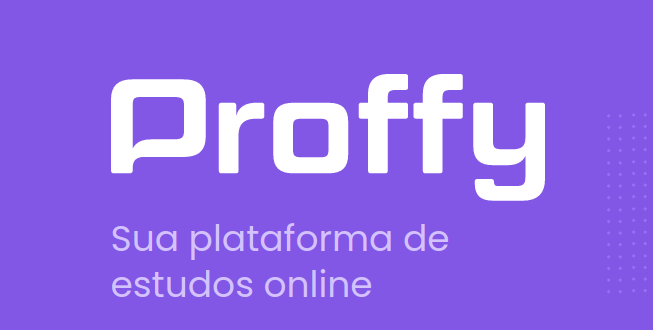
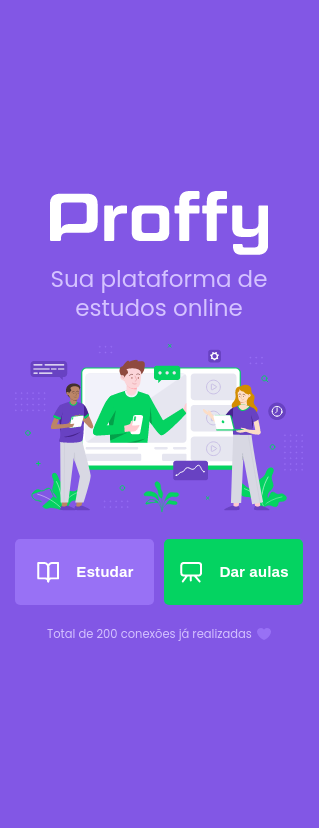
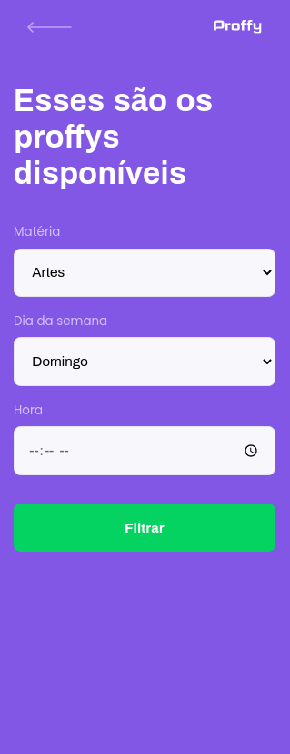
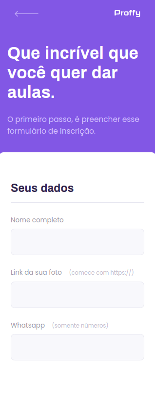

<h1 align="center">
    
</h1>

<h2 align="center">
  Next Level Week - 2ª Edição :flying_saucer:
</h2>

  <a href="#rocket-projeto">Projeto</a>&nbsp;&nbsp;&nbsp;|&nbsp;&nbsp;&nbsp;
  <a href="#gem-layout">Layout</a>&nbsp;&nbsp;&nbsp;|&nbsp;&nbsp;&nbsp;
  <a href="#artificial_satellite-tecnologias">Tecnologias</a>&nbsp;&nbsp;&nbsp;|&nbsp;&nbsp;&nbsp;
  <a href="#gear-funcionalidades">Funcionalidades</a>&nbsp;&nbsp;&nbsp;|&nbsp;&nbsp;&nbsp;
  <a href="#computer-como-contribuir">Como contribuir</a>&nbsp;&nbsp;&nbsp;|&nbsp;&nbsp;&nbsp;
  <a href="#file_folder-licença">Licença</a>

 

## :rocket: Projeto

O projeto <strong>Proffy</strong> foi proposto durante a semana <strong>Next Level Week - 2ª Edição</strong>. O <strong>Proffy</strong> é um projeto de estudos online que possibilita a conexão entre alunos e professores. O objetivo desse projeto é colocar em prática todo o conhecimento adquirido na semana da <strong>Next Level Week - 2ª Edição</strong>.

Essa semana insana foi ministrada pelo queridíssimo instrutor [Mayk Brito](https://github.com/maykbrito) da [Rocketseat](https://rocketseat.com.br/), que contribuiu muito para refatorar meu conhecimento na área.

## :gem: Layout

<h3><strong>Versão Web</strong></h3>

<h2 align="center">
    
</h2>

<h3><strong>Versão Mobile</strong></h3>

<h4 display="flex" align="center">
    
    
    
</h4>

## :artificial_satellite: Tecnologias

Esse projeto foi desenvolvido com as seguintes tecnologias:

- [Node.js](https://nodejs.org/en/)
- [React](https://reactjs.org)
- [Express](https://expressjs.com/)
- [Outras](#)

## :gear: Funcionalidades

Como funcionalidades da aplicação, temos:

- Sendo estudante: é possível efetuar um filtro da disciplina, dia da semana e horário em que há disponibilidade de professores cadastrados;
- Sendo professor: possibilita o cadastramento dos professores com interesse em ministrar aulas.

## :computer: Como contribuir
- Faça um fork desse repositório;
- Cria uma branch com a sua feature: git checkout -b minha-feature;
- Faça commit das suas alterações: git commit -m 'feat: Minha nova feature';
- Faça push para a sua branch: git push origin minha-feature.
- Depois que o merge da sua pull request for feito, você pode deletar a sua branch.

## :file_folder: Licença
Esse projeto está sob a licença MIT. Veja o arquivo [LICENSE](LICENSE.md) para mais detalhes.

 

#### 
#usemascara :mask: 

